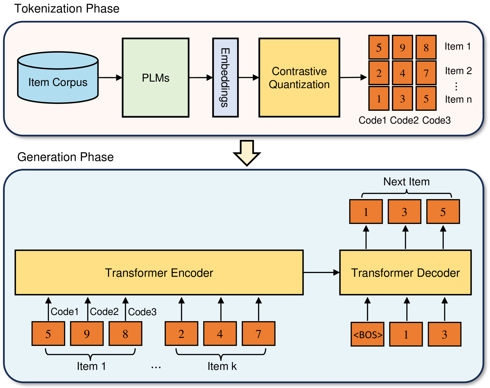
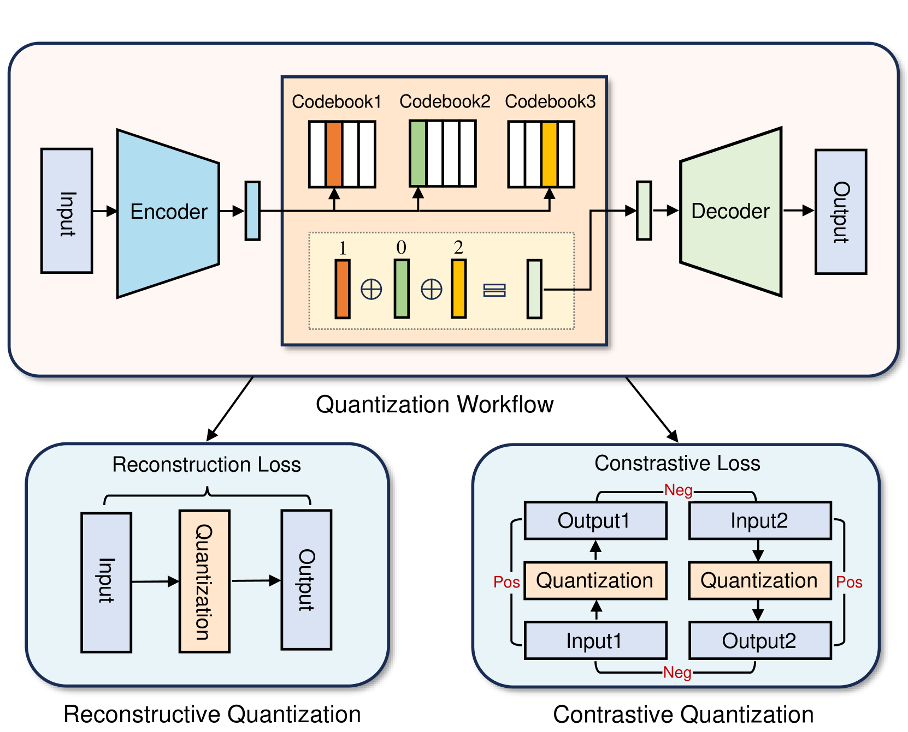
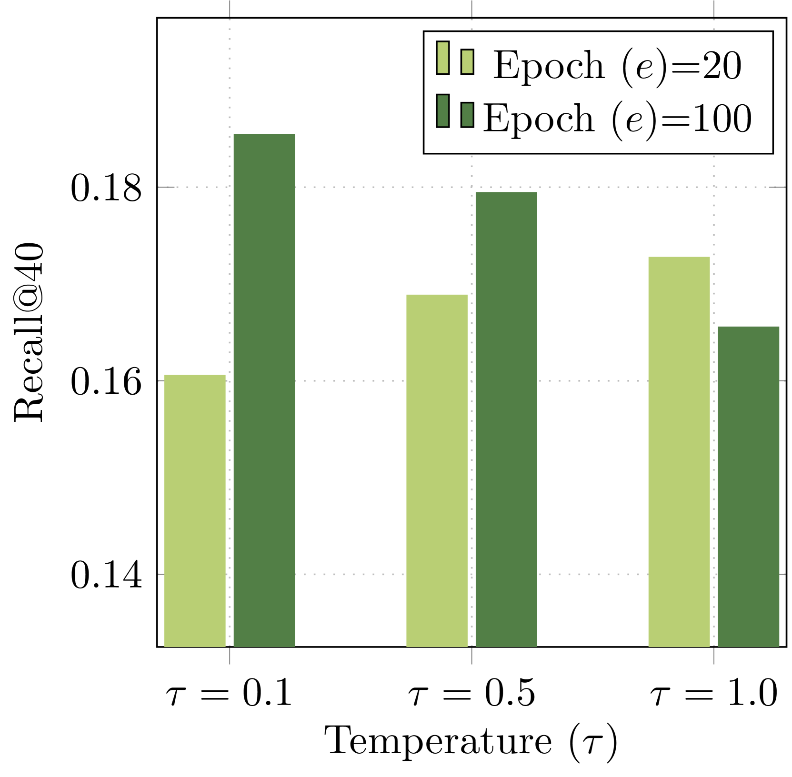
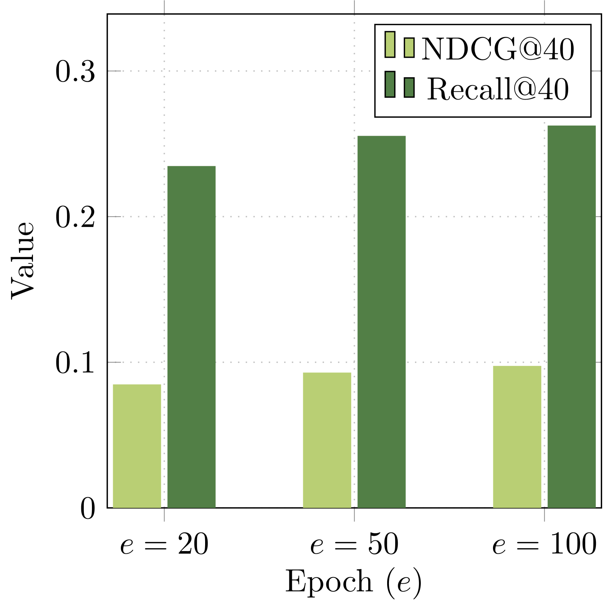
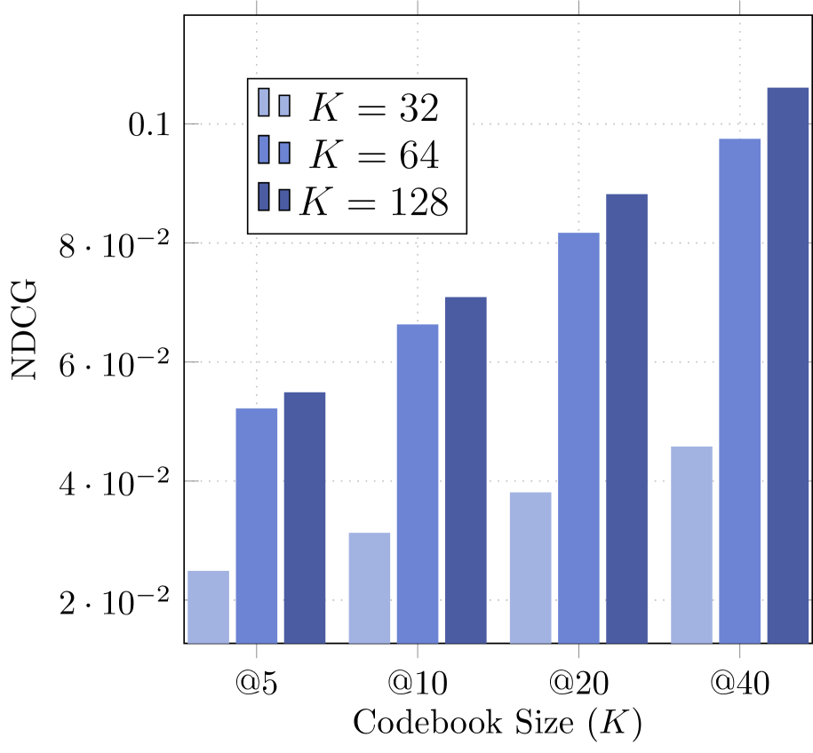
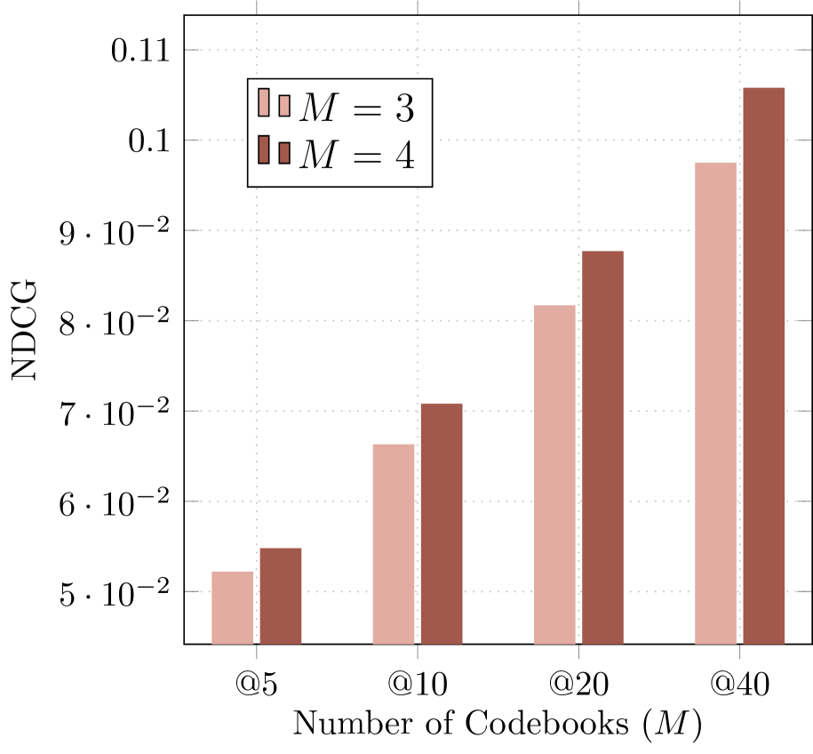
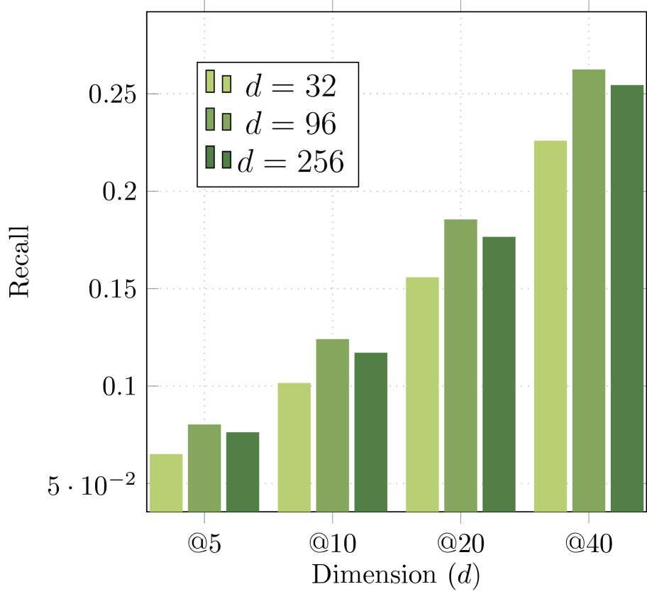

# CoST: Contrastive Quantization based Semantic Tokenization for Generative Recommendation

Подробное саммари статьи:

> Jieming Zhu, Mengqun Jin, Qijiong Liu, Zexuan Qiu, Zhenhua Dong, Xiu Li. 2024. **CoST: Contrastive Quantization based Semantic Tokenization for Generative Recommendation**. RecSys '24. DOI: <https://doi.org/10.1145/3640457.3688178>. arXiv: <https://arxiv.org/abs/2404.14774>.

Рисунки из статьи сохранены локально в `assets/cost/` и встроены ниже в соответствующий раздел.

## 1. Коротко: о чем статья

CoST предлагает улучшить этап **semantic tokenization** в генеративных рекомендательных системах. В таких системах item retrieval формулируется как задача генерации последовательности токенов: модель по истории пользователя генерирует не вектор для ANN-поиска, а дискретные semantic IDs целевого item'а. Это похоже на то, как языковая модель генерирует токены текста, только токены здесь кодируют товары, новости или другие объекты рекомендаций.

Главная идея статьи: стандартная RQ-VAE-токенизация, используемая в TIGER, обучается через **точную реконструкцию эмбеддинга item'а**, но для retrieval важнее не восстановить embedding один-в-один, а сохранить **относительные отношения между item'ами**: какой item ближе, какой дальше, какие объекты нужно различать в плотных областях пространства. CoST заменяет MSE-реконструкцию на **contrastive loss** между исходным embedding'ом item'а и его реконструкцией после квантования. То есть реконструкция должна быть ближе к своему исходному item'у, чем к реконструкциям других item'ов в batch'е.

В экспериментах CoST используется как drop-in замена RQ-VAE-токенизации внутри TIGER. На MIND авторы показывают до **+43.34% Recall@5** и **+43.76% NDCG@5** относительно reconstruction-based RQ-VAE. На Amazon Office улучшения тоже есть, но они заметно слабее на большем Office(L), особенно по Recall.

## 2. Контекст: зачем нужны semantic tokens

Типичный промышленный recommender часто работает по схеме **retrieve-then-rank**:

1. Retrieval stage быстро достает несколько сотен или тысяч кандидатов из большого каталога.
2. Ranking stage дорого и точно переоценивает кандидатов.

Классический retrieval обычно строится через:

- two-tower models: user tower и item tower, затем dot product / cosine similarity;
- graph-based retrieval: item-user graph, GNN или упрощенные graph embeddings;
- ANN index, например Faiss, для быстрого top-k поиска по векторному пространству.

У такого подхода есть несколько ограничений:

- retrieval score часто ограничен простой похожестью векторов, например dot product;
- embedding model и ANN index оптимизируются раздельно;
- ANN-инфраструктура является внешним недифференцируемым компонентом;
- модель retrieval не генерирует item напрямую, а только предоставляет вектор для поиска.

Генеративный retrieval предлагает альтернативу: представить item не как один атомарный ID и не только как dense vector, а как **последовательность дискретных semantic tokens**. Тогда задача next-item recommendation превращается в seq2seq:

```text
история пользователя -> последовательность токенов следующего item'а
```

После генерации токенов модель делает lookup в таблице `semantic token sequence -> item ID` и получает рекомендации.

## 3. Как выглядит generative recommendation pipeline

В статье используется framework, близкий к TIGER:

1. **Tokenization phase**
   - Берутся текстовые поля item'а: категория, подкатегория, title, description, brand и т.п.
   - Они превращаются в dense semantic embedding через pretrained text encoder, например Sentence-T5 или E5.
   - Затем embedding дискретизируется в последовательность semantic tokens.

2. **Generation phase**
   - История пользователя представляется как длинная последовательность semantic tokens всех прошлых item'ов.
   - Encoder-decoder Transformer обучается предсказывать tokens следующего item'а.
   - На inference используется beam search.
   - Сгенерированные token sequences мапятся обратно в item IDs.

Авторы подчеркивают: качество первой фазы критично. Если токены плохо отражают item space, даже хороший Transformer дальше будет учиться на плохом дискретном представлении.

## 4. Мотивация CoST

### 4.1. Что не так с RQ-VAE в этой задаче

TIGER использует RQ-VAE, чтобы превратить item embedding в tuple кодов. RQ-VAE учится минимизировать reconstruction loss: исходный embedding `x` после encoder, residual quantization и decoder должен быть восстановлен как `x_hat`, близкий к `x` по MSE.

Это логично для задач вроде image/audio tokenization, где tokenization должна сохранить достаточно информации для восстановления сигнала. Но recommendation retrieval имеет другую цель. Там не обязательно идеально восстановить исходный embedding; важнее:

- различать похожие, но разные item'ы;
- сохранять локальную структуру соседства;
- избегать слипания популярных или семантически близких item'ов в одинаковые token sequences;
- строить token space, удобный для autoregressive generation.

Авторы утверждают, что reconstruction-based objective рассматривает item'ы слишком независимо. Каждый item пытаются восстановить сам по себе, без явного требования правильно организовать отношения между item'ами внутри batch'а или локального neighborhood.

### 4.2. Проблема плотных областей и long tail

В recommender data часто есть long-tail distribution:

- мало популярных item'ов имеют много взаимодействий;
- много редких item'ов имеют мало взаимодействий;
- текстовые embedding'и могут образовывать плотные кластеры вокруг популярных тем или категорий.

Если RQ-VAE реконструирует embedding'и независимо, в плотной области несколько похожих item'ов могут получить одинаковые или очень похожие semantic IDs. Для генеративного retrieval это опасно: модель может сгенерировать правильный coarse semantic region, но не различить конкретный target item.

CoST пытается решить именно эту проблему: не просто приблизить `x_hat` к `x`, а сделать так, чтобы `x_hat_i` был более похож на свой `x_i`, чем на другие `x_j` / `x_hat_j` из batch'а.

### 4.3. Главный сдвиг в постановке задачи

RQ-VAE спрашивает:

> Насколько точно я могу восстановить исходный embedding item'а из его дискретных кодов?

CoST спрашивает:

> Насколько хорошо я могу отличить правильную reconstruction данного item'а от reconstruction других item'ов?

Это важный концептуальный сдвиг: CoST делает semantic tokenization более retrieval-oriented.

## 5. Базовая механика residual quantization

CoST сохраняет архитектурный каркас RQ-VAE:

- encoder `E`;
- набор codebooks;
- residual quantizer;
- decoder;
- straight-through estimator / quantization loss для обучения codebooks.

Пусть `x` - dense item embedding, например 768-dimensional Sentence-T5 vector.

### 5.1. Encoder

Сначала MLP encoder переводит `x` в более низкоразмерное latent representation:

```text
z = E(x)
```

В экспериментах:

- входной embedding: 768 dimensions;
- encoder hidden layers: `[512, 256, 128]`;
- latent dimension: 96.

### 5.2. Residual quantization

Есть `M` codebooks:

```text
C_i = {e_i^k | k = 1, ..., K}, для i = 1, ..., M
```

где:

- `M` - число уровней / codebooks;
- `K` - размер каждого codebook;
- `e_i^k` - code vector;
- выбранный индекс `c_i` становится semantic token на уровне `i`.

Процедура:

1. Начальный residual:

```text
r_0 = z
```

2. В первом codebook выбирается ближайший code vector:

```text
c_1 = argmin_k ||r_0 - e_1^k||_2
```

3. Считается остаток:

```text
r_1 = r_0 - e_1^{c_1}
```

4. Остаток квантуется вторым codebook.

5. Процесс повторяется `M` раз.

На выходе item получает tuple:

```text
(c_1, c_2, ..., c_M)
```

В основном setup статьи:

- `M = 3`;
- `K = 64`;
- semantic ID каждого item'а - 3-token tuple;
- codebooks shared across three levels, согласно описанию авторов.

Теоретическая емкость token space при `K=64, M=3` равна:

```text
64^3 = 262,144 возможных token sequences
```

Для датасетов статьи этого достаточно: MIND содержит 12,251 item, Office(L) - 37,347 item. Но важно, что большая теоретическая емкость не гарантирует хорошую фактическую утилизацию codebook'ов и отсутствие коллизий.

## 6. Reconstruction-based objective: что делает RQ-VAE

После residual quantization code vectors суммируются:

```text
z_hat = sum_{i=1}^{M} e_i^{c_i}
```

Затем decoder восстанавливает embedding:

```text
x_hat = D(z_hat)
```

Классическая loss:

```text
L_re = L_mse + L_rq
```

где:

```text
L_mse = ||x - x_hat||_2^2
```

`L_rq` - quantization/codebook loss со stop-gradient, аналогично VQ-VAE:

```text
L_rq = sum_i ||sg(r_{i-1}) - e_i^{c_i}||_2^2
     + beta * ||r_{i-1} - sg(e_i^{c_i})||_2^2
```

Смысл двух частей:

- первая часть двигает code vector к residual;
- вторая часть, commitment term, заставляет encoder output не убегать от выбранного code vector;
- `sg` означает stop-gradient;
- `beta` контролирует commitment.

Чтобы снизить риск codebook collapse, авторы используют k-means initialization: на первом training batch делают k-means, а centroids берут как начальные code vectors.

## 7. Contrastive quantization в CoST

CoST сохраняет `L_rq`, но заменяет MSE-реконструкцию на contrastive objective.

### 7.1. Positive pair

Для item `0` positive pair:

```text
(x_0, x_hat_0)
```

где:

- `x_0` - исходный semantic embedding item'а;
- `x_hat_0` - embedding, восстановленный после encoder, residual quantization и decoder.

### 7.2. Negative examples

Negatives - reconstructed vectors других item'ов в batch'е:

```text
{x_hat_i | i = 1, ..., K_batch}
```

В тексте формула использует `K` как число других векторов в batch'е, что немного перегружает обозначения, потому что `K` уже используется как codebook size. По смыслу здесь речь о batch negatives.

### 7.3. Contrastive loss

Loss:

```text
L_cl = -log exp(<x_0, x_hat_0> / tau)
            / sum_{i=0}^{K_batch} exp(<x_0, x_hat_i> / tau)
```

где:

- `<., .>` - cosine similarity;
- `tau` - temperature;
- positive pair должен получить максимальную вероятность среди reconstructed candidates.

Итоговая CoST objective:

```text
L_co = alpha * L_cl + L_rq
```

В экспериментах:

- `alpha = 0.1`;
- `beta = 0.25`;
- `tau = 0.1`.

### 7.4. Интуиция

MSE говорит: "восстанови координаты embedding'а".

Contrastive loss говорит: "сохрани идентичность item'а относительно других item'ов".

Это лучше соответствует retrieval: модель должна выбрать правильный item среди множества кандидатов. Даже если `x_hat` не идеально совпадает с `x` по всем координатам, он полезен, если остается ближе к своему item'у, чем к чужим.

### 7.5. Почему это может улучшить semantic IDs

CoST может помочь по нескольким причинам:

- **Более явное разделение item'ов.** В batch'е каждый item конкурирует с другими, что снижает вероятность слипания reconstruction'ов.
- **Сохранение локального neighborhood.** Если два item'а близки, contrastive objective вынуждает модель аккуратнее различать их, а не просто приблизительно реконструировать оба.
- **Retrieval-aligned objective.** Рекомендательная задача ближе к ranking/classification среди candidates, чем к regression reconstruction.
- **Меньше зависимости от точной геометрии PLM embedding'а.** MSE слепо наследует все координатные особенности embedding space, включая шум. Contrastive loss фокусируется на относительной близости.

## 8. Как CoST интегрируется в TIGER

CoST не предлагает новый generative recommender целиком. Это важно: вклад статьи находится в **tokenization phase**, а не в Transformer generation phase.

Pipeline:

1. Для каждого item строится text embedding через Sentence-T5.
2. CoST обучает residual quantizer с contrastive objective.
3. Каждый item получает semantic token tuple.
4. Последовательности взаимодействий пользователя заменяются последовательностями semantic tokens.
5. TIGER-like encoder-decoder Transformer обучается next-item token generation.
6. На inference:
   - decoder генерирует token tuple;
   - beam search возвращает несколько token sequences;
   - token-to-item lookup превращает sequences в item IDs.

Сильная сторона такой постановки: CoST можно рассматривать как относительно локальную замену RQ-VAE в существующих generative retrieval системах.

Слабая сторона: если generation architecture, beam search или token-to-item mapping имеют собственные ограничения, CoST их не решает.

## 9. Рисунки и что в них важно

### Figure 1: Framework of generative recommendation



Рисунок показывает две фазы:

- **Tokenization Phase**
  - item corpus;
  - PLM embeddings;
  - contrastive quantization;
  - каждому item назначается sequence из code tokens, например `(5, 9, 8)`.

- **Generation Phase**
  - user history подается в Transformer encoder;
  - Transformer decoder autoregressively генерирует semantic tokens следующего item;
  - token sequence мапится обратно в item.

Почему рисунок полезен:

- Он фиксирует, что CoST работает до обучения recommendation Transformer.
- Он показывает, что semantic tokenization уменьшает vocabulary: вместо миллионов item IDs модель работает с тысячами code tokens.
- Он объясняет, почему ошибка токенизации потом распространяется на весь generation stage.

Практическая интерпретация: если tokenization делает плохие semantic IDs, Transformer будет учиться на "битом языке item'ов".

### Figure 2: Reconstructive vs Contrastive Quantization



Это главный методологический рисунок.

Левая часть:

- input проходит quantization;
- output/reconstruction сравнивается с input через reconstruction loss;
- каждый item фактически оптимизируется сам по себе.

Правая часть:

- input/output своего item'а образуют positive pair;
- outputs других item'ов выступают negatives;
- contrastive loss заставляет correct reconstruction быть ближе к own input, чем к чужим.

Почему рисунок важен:

- Он показывает единственное ключевое изменение CoST относительно RQ-VAE: objective меняется с coordinate-level reconstruction на pairwise discrimination.
- Он помогает понять, почему авторы говорят о neighborhood relationships.

### Figure 3: Temperature `tau` и число эпох





Рисунок анализирует MIND:

- `tau` тестируется в `{0.1, 0.5, 1.0}`;
- CoST обучается 20 и 100 эпох;
- отдельно показывается динамика при 20, 50, 100 эпохах.

Выводы авторов:

- качество чувствительно к temperature;
- при 20 эпохах лучший Recall@40 получается при одном `tau`, при 100 эпохах - при другом;
- увеличение числа эпох улучшает NDCG и Recall, loss снижается.

Критическое замечание:

- такой результат означает не только "CoST хорошо обучается", но и то, что метод требует настройки training budget и `tau`;
- в production-постановке это может быть нетривиально, особенно при больших каталогах и частом обновлении item corpus.

### Figure 4: Sensitivity analysis по codebook hyperparameters







Рисунок изучает:

- codebook size `K`;
- number of codebooks `M`;
- embedding dimension `d`.

Основные выводы:

- увеличение `K` улучшает NDCG;
- увеличение `M` улучшает NDCG;
- увеличение `d` с 32 до 96 помогает;
- `d = 256` уже ухудшает качество, авторы связывают это с overfitting.

Интерпретация:

- большее token space помогает точнее представить item'ы;
- но слишком высокая latent capacity может переобучаться;
- tokenization quality зависит от компромисса между емкостью semantic ID space и learnability генеративной модели.

## 10. Таблицы и результаты

### Table 1: Dataset statistics

| Dataset | #Users | #Items | Seq_Len | Avg seq len | Median |
|---|---:|---:|---|---:|---:|
| MIND | 29,207 | 12,251 | [15, 70] | 25.06 | 22 |
| Office(S) | 2,868 | 14,618 | [10, 20] | 13.21 | 12 |
| Office(L) | 16,696 | 37,347 | [5, 50] | 8.38 | 12 |

Важные детали preprocessing:

- MIND: оставляют interactions с at least 15 users, sequence length capped at 70.
- Amazon Office: фильтруют users with fewer than 5 interactions.
- Office разделяют на small и large, чтобы посмотреть влияние числа item'ов.
- Для MIND используют category, sub-category, title.
- Для Amazon используют type, brand, title, category.
- Sentence-T5 дает 768-dimensional item embeddings.

Что бросается в глаза:

- Office(L) имеет больше item'ов, но средняя sequence length ниже, чем у MIND.
- Office(S) очень мал по users: 2,868, что делает результаты потенциально шумными.
- MIND выглядит наиболее сильным benchmark'ом в статье.

### Table 2: Results on MIND

| Method | Metric | @5 | @10 | @20 | @40 |
|---|---|---:|---:|---:|---:|
| Random | NDCG | 0.0201 | 0.0265 | 0.0327 | 0.0390 |
| Random | Recall | 0.0319 | 0.0519 | 0.0766 | 0.1075 |
| `L_re` | NDCG | 0.0363 | 0.0474 | 0.0594 | 0.0727 |
| `L_re` | Recall | 0.0560 | 0.0905 | 0.1384 | 0.2031 |
| `L_co` | NDCG | 0.0522 | 0.0663 | 0.0817 | 0.0975 |
| `L_co` | Recall | 0.0803 | 0.1241 | 0.1855 | 0.2625 |
| `L_re + L_co` | NDCG | 0.0444 | 0.0574 | 0.0710 | 0.0865 |
| `L_re + L_co` | Recall | 0.0677 | 0.1081 | 0.1621 | 0.2376 |
| Improvement over `L_re` | NDCG | 43.76% | 39.90% | 37.52% | 34.10% |
| Improvement over `L_re` | Recall | 43.34% | 37.21% | 34.05% | 29.24% |

Главный результат:

- pure contrastive CoST (`L_co`) лучше reconstruction baseline (`L_re`) на всех k;
- комбинация `L_re + L_co` хуже, чем pure `L_co`, но лучше `L_re`.

Это важная деталь: добавление reconstruction loss не помогает на MIND. Значит, точная реконструкция может не просто быть ненужной, а мешать retrieval-aligned tokenization.

### Table 3: Results on Amazon Office

| Method | Metric | Office(S) @10 | Office(S) @20 | Office(L) @10 | Office(L) @20 |
|---|---|---:|---:|---:|---:|
| `L_re` | NDCG | 0.0024 | 0.0032 | 0.0041 | 0.0053 |
| `L_re` | Recall | 0.0037 | 0.0068 | 0.0075 | 0.0123 |
| `L_co` | NDCG | 0.0034 | 0.0043 | 0.0047 | 0.0059 |
| `L_co` | Recall | 0.0060 | 0.0094 | 0.0079 | 0.0125 |
| `L_re + L_co` | NDCG | 0.0035 | 0.0042 | 0.0042 | 0.0052 |
| `L_re + L_co` | Recall | 0.0066 | 0.0096 | 0.0079 | 0.0119 |
| Improvement | NDCG | 43.80% | 31.06% | 15.11% | 10.53% |
| Improvement | Recall | 80.95% | 41.03% | 5.38% | 1.46% |

Интерпретация:

- на Office(S) gains большие, особенно Recall@10;
- на Office(L) gains существенно меньше;
- `L_re + L_co` лучше на Office(S), но не на Office(L);
- pure `L_co` выглядит устойчивее на большем наборе.

Критический момент:

- абсолютные значения метрик на Office очень низкие;
- относительные улучшения могут выглядеть впечатляюще из-за низкой базы;
- на Office(L) Recall improvement 1.46% at @20 практически скромный.

## 11. Алгоритм CoST пошагово

Ниже - реконструкция алгоритма в удобном виде.

### Input

- Item corpus `I`.
- Для каждого item доступны текстовые поля.
- Pretrained text encoder, например Sentence-T5.
- Hyperparameters:
  - number of codebooks `M`;
  - codebook size `K`;
  - latent dimension `d`;
  - contrastive temperature `tau`;
  - quantization commitment `beta`;
  - contrastive weight `alpha`;
  - batch size.

### Training semantic tokenizer

1. **Build item text**

   Для каждого item создать prompt:

   ```text
   Item category: <category>. Title: <title>. Description: <description>.
   ```

   Для Amazon Office вместо description могут использоваться type, brand, title, category.

2. **Encode text**

   Получить dense vector:

   ```text
   x_i = PLM(text_i)
   ```

3. **Project to latent**

   ```text
   z_i = E(x_i)
   ```

4. **Residual quantization**

   Для каждого уровня `m = 1..M`:

   - найти nearest code vector в codebook `C_m`;
   - записать code index `c_{i,m}`;
   - обновить residual.

5. **Reconstruct**

   ```text
   z_hat_i = sum_m e_m^{c_{i,m}}
   x_hat_i = D(z_hat_i)
   ```

6. **Compute batch contrastive loss**

   Для каждого item в batch positive pair - `(x_i, x_hat_i)`, negatives - `x_hat_j` других item'ов.

7. **Compute quantization loss**

   Использовать `L_rq`, чтобы обучать encoder/codebooks через straight-through estimator.

8. **Optimize**

   ```text
   L_co = alpha * L_cl + L_rq
   ```

9. **Export semantic IDs**

   После обучения для каждого item сохранить:

   ```text
   item_id -> (c_1, ..., c_M)
   ```

### Training generative recommender

1. Заменить item history пользователя на token sequence.
2. Обучить TIGER-like encoder-decoder Transformer.
3. Использовать leave-one-out:
   - last item: test;
   - penultimate item: validation;
   - previous items: train.
4. На inference использовать beam search.
5. Вернуть top-k item IDs через lookup.

## 12. Что именно является вкладом статьи

Вклад не в том, что авторы впервые используют semantic IDs. Это уже есть в DSI, TIGER, EAGER, semantic indexing работах.

Основные вклады:

1. **Постановка semantic tokenization как contrastive quantization.**
   Авторы переносят contrastive objective внутрь residual quantization для generative recommendation.

2. **Аргумент против чистой MSE-реконструкции.**
   Они показывают, что reconstruction objective не идеально соответствует retrieval.

3. **Простая интеграция с существующим framework.**
   CoST заменяет RQ-VAE в TIGER без изменения autoregressive generator.

4. **Эмпирический сигнал, что tokenization objective сильно влияет на итоговый generative recommender.**
   На MIND разница между `L_re` и `L_co` очень большая.

5. **Sensitivity analysis по tokenization hyperparameters.**
   Статья показывает, что `K`, `M`, `d`, `tau`, epochs заметно влияют на качество.

## 13. Плюсы статьи и метода

### 13.1. Хорошая постановка проблемы

Статья правильно фокусируется на semantic tokenization как на отдельном bottleneck. В generative recommendation часто основное внимание уходит на Transformer/generator, но если item language плохой, downstream model ограничена с самого начала.

### 13.2. Objective лучше соответствует retrieval

Contrastive loss естественнее для retrieval, чем MSE. Retrieval - это выбор правильного item среди конкурентов, а не восстановление embedding coordinates. CoST делает quantizer ближе к ranking/discrimination objective.

### 13.3. Минимальное изменение архитектуры

CoST не требует менять весь recommender. Это удобно:

- можно заменить tokenizer;
- можно оставить generation phase прежней;
- можно сравнивать tokenization objectives достаточно чисто.

### 13.4. Хорошие результаты на MIND

На MIND gains крупные и последовательные по Recall/NDCG и по всем k. Это сильный аргумент, что reconstruction objective действительно может быть неоптимальным.

### 13.5. Полезный анализ hyperparameters

Figure 3 и Figure 4 показывают, что tokenization не является одноразовой технической деталью. Размер codebook, число codebooks, latent dimension и temperature реально меняют результат.

### 13.6. Метод концептуально простой

CoST легко объяснить:

- positive pair: original item embedding + its quantized reconstruction;
- negatives: reconstructions of other batch items;
- loss: InfoNCE-like contrastive objective.

Это делает работу полезной как building block для дальнейших исследований.

## 14. Минусы, спорные моменты и недоработки

### 14.1. Небольшой масштаб экспериментов

Статья короткая, всего около 6 страниц, и экспериментальная часть ограничена:

- MIND;
- Amazon Office(S);
- Amazon Office(L).

Нет проверки на действительно industrial-scale catalog с миллионами item'ов. Но именно в таких сценариях semantic tokenization и ANN replacement наиболее интересны.

### 14.2. Слабая baseline coverage

Сравнение в основном идет между:

- random hashing;
- reconstruction RQ-VAE (`L_re`);
- contrastive CoST (`L_co`);
- combination (`L_re + L_co`).

Не хватает широкого сравнения с:

- hierarchical k-means tokenization;
- EAGER-style behavior-semantic tokenization;
- TokenRec / learnable tokenization approaches;
- semantic IDs from collaborative signals;
- simple strong dense retrieval baselines under the same evaluation.

Авторы используют TIGER as baseline framework, но не показывают полную картину конкурирующих tokenization methods.

### 14.3. Нет подробного анализа коллизий semantic IDs

Мотивация говорит, что RQ-VAE может назначать одинаковые token sequences похожим item'ам в плотных областях. Но в статье почти нет прямых метрик:

- collision rate;
- codebook utilization;
- entropy по codebooks;
- distribution of token sequence frequencies;
- number of items per semantic ID;
- collision impact on Recall/NDCG.

Без этого трудно понять, улучшает ли CoST именно collision/neighborhood проблему или просто дает regularization effect.

### 14.4. Top-one contrastive objective может быть слишком узким

Сами авторы в conclusion признают: CoST фокусируется на top-one neighborhood alignment. Но recommendation часто требует top-k neighborhood structure:

- item может иметь несколько релевантных соседей;
- substitutable/complementary relations не сводятся к одному positive;
- batch negatives могут содержать false negatives.

Например, две почти одинаковые новости или два похожих офисных товара могут оказаться negatives друг для друга, хотя с точки зрения recommendation они близкие и взаимозаменяемые.

### 14.5. Batch negatives могут быть шумными

CoST использует другие item'ы в batch как negatives. Это стандартно для contrastive learning, но здесь есть риски:

- false negatives: похожие item'ы считаются отрицательными;
- batch composition сильно влияет на сигнал;
- при малом batch может быть недостаточно hard negatives;
- при большом каталоге batch negatives могут плохо аппроксимировать глобальное item space.

Статья не исследует:

- hard negative mining;
- cross-batch memory;
- debiased contrastive loss;
- sampled softmax over larger candidate pools;
- relation-aware positives.

### 14.6. Текстовые embedding'и не обязательно отражают recommendation semantics

CoST стартует с PLM embedding'ов текстовых полей. Это хорошо для cold-start и semantic indexing, но recommendation relevance часто зависит от:

- co-click / co-purchase behavior;
- user intent;
- popularity;
- temporal trends;
- complementarity, а не только semantic similarity;
- domain-specific taxonomy.

Авторы почти не интегрируют collaborative signals в tokenizer. В related work они упоминают EAGER, TokenRec, LETTER, но CoST сам остается в основном text-semantic tokenizer.

### 14.7. Неясно, насколько улучшение связано именно с "neighborhood relationships"

Contrastive objective действительно меняет pairwise geometry. Но статья не дает глубокого embedding-space анализа:

- nearest-neighbor preservation до/после quantization;
- trustworthiness / continuity метрики;
- visualization of token clusters;
- intra-category vs inter-category separation;
- ranking correlation между original PLM space и quantized reconstruction space.

Поэтому causal story убедительна, но не полностью доказана.

### 14.8. Не раскрыта production сторона

Generative retrieval обещает убрать ANN index, но production deployment требует ответов на вопросы:

- как часто переобучать tokenizer при появлении новых item'ов;
- как добавлять new item без полного retraining;
- как обрабатывать deleted/updated item;
- как поддерживать token-to-item table при коллизиях;
- как контролировать latency beam search;
- как гарантировать diversity и business constraints;
- как совмещать generated candidates с существующим retrieval stack.

Статья это не рассматривает.

### 14.9. Ограниченная проверка на cold-start

Поскольку CoST использует текстовые embeddings, он потенциально подходит для item cold-start. Но статья не делает отдельного cold-start split:

- новые item'ы;
- новые категории;
- sparse interaction items;
- zero-shot item insertion.

Это упущенная возможность.

### 14.10. Слишком мало ablation по loss design

Было бы полезно сравнить:

- cosine contrastive vs dot-product contrastive;
- symmetric contrastive loss;
- original-to-reconstructed vs reconstructed-to-original directions;
- positives from nearest neighbors;
- supervised contrastive loss по категориям;
- contrastive + reconstruction с разными weights;
- memory bank / queue.

В статье есть только `L_re`, `L_co`, `L_re + L_co`.

### 14.11. Результаты на Office(L) выглядят умеренно

На Office(L) улучшения:

- NDCG@10: +15.11%;
- NDCG@20: +10.53%;
- Recall@10: +5.38%;
- Recall@20: +1.46%.

Это значительно слабее, чем на MIND и Office(S). Возможные причины:

- более sparse user histories;
- больше item'ов;
- текстовые fields хуже описывают recommendation behavior;
- token space / hyperparameters не оптимальны;
- contrastive negatives становятся менее полезными при большем и разреженном каталоге.

Этот результат снижает уверенность, что CoST масштабируется линейно и устойчиво.

## 15. Что можно было бы добавить в идеальной версии статьи

1. **Codebook diagnostics**
   - utilization per codebook;
   - perplexity;
   - dead codes;
   - entropy;
   - collision distribution.

2. **Token collision analysis**
   - сколько item'ов получают одинаковый tuple;
   - в каких категориях больше collisions;
   - как collisions коррелируют с ошибками recommendation.

3. **Neighborhood preservation metrics**
   - recall of nearest neighbors after quantization;
   - rank correlation между original embedding space и quantized reconstruction space;
   - category purity.

4. **Hard negative experiments**
   - random in-batch negatives vs nearest-neighbor negatives;
   - false negative mitigation;
   - cross-batch memory.

5. **Collaborative semantic tokenization**
   - добавить user-item behavior graph;
   - использовать co-click positives;
   - contrastive positives не только own reconstruction, но и behavior-neighbor item'ы.

6. **Cold-start evaluation**
   - new item split;
   - new category split;
   - item with no interactions but text available.

7. **Industrial constraints**
   - update strategy for new items;
   - latency of beam search;
   - memory footprint;
   - online A/B-like proxy.

8. **Comparison with stronger tokenizers**
   - hierarchical clustering;
   - EAGER;
   - LETTER;
   - TokenRec;
   - semantic ID ranking approaches.

## 16. Практические выводы для исследователя или инженера

### 16.1. Semantic tokenizer - это не preprocessing detail

CoST показывает, что tokenization objective может дать большую разницу в итоговом recommender quality. Поэтому semantic IDs нельзя воспринимать как нейтральный preprocessing.

### 16.2. Reconstruction loss не всегда правильная цель

Если downstream задача - retrieval, стоит оптимизировать tokenizer под discrimination/ranking, а не только под reconstruction.

### 16.3. Batch contrastive objective - хороший первый шаг

CoST прост и может быть baseline для новых tokenization ideas:

- contrastive semantic tokenizer;
- multimodal contrastive tokenizer;
- collaborative contrastive tokenizer;
- top-k neighborhood-aware tokenizer.

### 16.4. Но нужны диагностики

При реализации CoST-like подхода стоит обязательно логировать:

- codebook utilization;
- token collision rate;
- distribution of semantic IDs;
- nearest-neighbor preservation;
- downstream Recall/NDCG;
- invalid generated token sequences;
- beam search hit rate.

Без этих метрик можно получить downstream gain, но не понимать, почему он появился.

## 17. Возможная реализация в псевдокоде

```python
# 1. Build text embeddings
texts = [format_item_text(item) for item in items]
X = sentence_t5.encode(texts)  # [num_items, 768]

# 2. Train CoST tokenizer
for batch in dataloader(X):
    x = batch  # [B, 768]

    z = encoder(x)  # [B, d]
    residual = z
    selected_codes = []
    selected_vectors = []

    for m in range(M):
        # nearest code vector in codebook m
        code_idx = nearest_code(residual, codebook[m])
        code_vec = codebook[m][code_idx]

        selected_codes.append(code_idx)
        selected_vectors.append(code_vec)
        residual = residual - code_vec

    z_hat = sum(selected_vectors)
    x_hat = decoder(z_hat)

    # cosine similarities between original x_i and reconstructed x_hat_j
    logits = cosine_similarity_matrix(x, x_hat) / tau
    labels = torch.arange(len(x))

    L_cl = cross_entropy(logits, labels)
    L_rq = residual_quantization_loss(...)

    loss = alpha * L_cl + L_rq
    loss.backward()
    optimizer.step()

# 3. Export semantic IDs
semantic_ids = {}
for item, x in zip(items, X):
    semantic_ids[item.id] = cost_tokenizer.encode(x)  # tuple(c1, ..., cM)
```

Важно: этот псевдокод передает идею, но не все детали straight-through estimator и stop-gradient.

## 18. Спорные интерпретации

### 18.1. "CoST captures neighborhood relationships" - частично да, но формально ограниченно

Contrastive loss действительно использует other items in batch. Но positive pair - это только `(x_i, x_hat_i)`, а не `(x_i, x_neighbor)`. Поэтому CoST скорее учит **instance discrimination** и indirectly preserves neighborhood, чем напрямую моделирует top-k neighborhood graph.

Более сильная версия neighborhood modeling могла бы использовать:

- nearest neighbors in PLM space as positives;
- co-click neighbors as positives;
- category-aware supervised contrastive positives;
- multi-positive InfoNCE.

### 18.2. Улучшение может быть связано с better separation, а не semantic understanding

Если contrastive loss просто сильнее разводит item'ы в representation space, это может улучшить Recall/NDCG, но не обязательно означает, что semantic tokens стали "семантически" лучше. Они могли стать более discriminative, но менее interpretable.

### 18.3. Удаление MSE может вредить переносимости

MSE сохраняет исходное PLM space более буквально. Contrastive loss может исказить embedding geometry ради текущего dataset'а. Это хорошо для in-domain retrieval, но может хуже работать для:

- transfer learning;
- new domains;
- zero-shot item insertion;
- explanation/interpretable semantic IDs.

### 18.4. Batch negatives могут конфликтовать с recommendation semantics

В recommendation похожие item'ы не всегда должны быть "разведены". Иногда похожие item'ы - хорошие substitutes, и их близость полезна. CoST же на уровне instance discrimination заставляет каждый item отличаться от других batch items.

Это может помогать точному next-item prediction, но потенциально вредить diversity, substitutability и broad recall.

## 19. Как я бы развивал CoST дальше

1. **Top-k contrastive quantization**
   - positive set включает nearest neighbors item'а;
   - own reconstruction остается главным positive;
   - neighborhood positives получают меньший вес.

2. **Behavior-aware CoST**
   - positives берутся из co-click/co-purchase graph;
   - text semantic similarity комбинируется с collaborative similarity.

3. **Debiased negatives**
   - не считать item negative, если он слишком близок по category/text/behavior;
   - использовать soft labels вместо hard one-hot labels.

4. **Adaptive token length**
   - popular/dense regions получают более длинные semantic IDs;
   - sparse regions получают короткие IDs.

5. **Multimodal CoST**
   - text + image + metadata + behavior;
   - contrastive objective между modalities и quantized reconstruction.

6. **Online update mechanism**
   - incremental code assignment для новых item'ов;
   - periodic codebook refresh;
   - backward-compatible semantic IDs.

7. **Joint tokenizer-generator training**
   - сейчас tokenizer обучается отдельно;
   - можно попробовать end-to-end или alternating optimization с downstream generation loss.

## 20. Итоговая оценка

CoST - небольшая, но полезная статья. Ее ценность не в сложной архитектуре, а в ясном observation: **для генеративного recommendation semantic tokenization должна быть retrieval-aware**. RQ-VAE с MSE-реконструкцией пришел из мира generative modeling, где важно восстановление сигнала. Но в item retrieval цель другая: различить правильный item среди конкурентов и сохранить полезную структуру item space.

Метод CoST делает простой шаг в правильную сторону: заменяет reconstruction-centric objective на contrastive objective. Эксперименты на MIND показывают сильный эффект. При этом статья оставляет много открытых вопросов: масштабирование, коллизии, false negatives, collaborative signals, cold-start, production lifecycle.

Моя оценка: CoST стоит читать как **важный baseline и conceptual pivot** для работ по semantic IDs. Это не окончательное решение tokenization problem, но хороший аргумент, что следующие поколения generative recommenders должны проектировать tokenizer не как autoencoder, а как retrieval/ranking-aware модуль.

## 21. Что читать после CoST

### Базовые работы по generative retrieval и semantic IDs

1. **[TIGER: Recommender Systems with Generative Retrieval](https://arxiv.org/abs/2305.05065)**  
   Rajput et al., NeurIPS 2023.  
   Главная предшествующая работа: RQ-VAE semantic IDs + autoregressive generation для recommendation. CoST фактически заменяет tokenizer в TIGER.

2. **[Transformer Memory as a Differentiable Search Index (DSI)](https://arxiv.org/abs/2202.06991)**  
   Tay et al., 2022.  
   Одна из ключевых работ по generative retrieval, где retrieval формулируется как генерация document IDs.

3. **[Autoregressive Entity Retrieval (GENRE)](https://arxiv.org/abs/2010.00904)**  
   De Cao et al., 2021.  
   Ранний пример retrieval через autoregressive generation entity names.

4. **[Better Generalization with Semantic IDs: A Case Study in Ranking for Recommendations](https://arxiv.org/abs/2306.08121)**  
   Singh et al., 2023/2024.  
   Полезно для понимания, почему semantic IDs могут улучшать generalization в recommendation.

### Работы про semantic tokenization в recommender systems

5. **[EAGER: Two-Stream Generative Recommender with Behavior-Semantic Collaboration](https://arxiv.org/abs/2406.14017)**  
   Wang et al., KDD 2024.  
   Важное продолжение темы: комбинирование semantic и behavioral information.

6. **[Learnable Item Tokenization for Generative Recommendation (LETTER)](https://arxiv.org/abs/2405.07314)**  
   Wang et al., 2024.  
   Про learnable item tokenization; хорошо читать после CoST, чтобы сравнить contrastive quantization и learnable tokenizer.

7. **[TokenRec: Learning to Tokenize ID for LLM-based Generative Recommendation](https://arxiv.org/abs/2406.10450)**  
   Qu et al., 2024/2025.  
   Еще одна линия learnable tokenization для LLM/generative recommendation.

8. **[How to Index Item IDs for Recommendation Foundation Models](https://arxiv.org/abs/2305.06569)**  
   Hua et al., 2023.  
   Обзорно-эмпирическая работа про разные способы item indexing в foundation-model-style recommendation.

9. **[Discrete Semantic Tokenization for Deep CTR Prediction](https://arxiv.org/abs/2403.08206)**  
   Liu et al., WWW Companion 2024.  
   Полезно, если интересует применение semantic tokenization не только в generative retrieval, но и в CTR prediction.

### Quantization и contrastive quantization

10. **[Neural Discrete Representation Learning / VQ-VAE](https://arxiv.org/abs/1711.00937)**  
    van den Oord et al., 2017/2018.  
    База для понимания vector quantization, codebook learning и straight-through estimator.

11. **[Autoregressive Image Generation using Residual Quantization](https://arxiv.org/abs/2203.01941)**  
    Lee et al., CVPR 2022.  
    Источник RQ-VAE/RQ-style residual quantization, на которую опираются TIGER и CoST.

12. **[SoundStream: An End-to-End Neural Audio Codec](https://arxiv.org/abs/2107.03312)**  
    Zeghidour et al., 2021.  
    Полезно для понимания residual vector quantization и k-means initialization в neural codecs.

13. **[Contrastive Quantization with Code Memory for Unsupervised Image Retrieval](https://arxiv.org/abs/2109.05205)**  
    Wang et al., AAAI 2022.  
    Близкая по духу работа: contrastive quantization для retrieval, но в image domain.

14. **[Improved Vector Quantization for Dense Retrieval with Contrastive Distillation](https://sigir.org/sigir2023/program/accepted-papers/short-papers/)**  
    O'Neill and Dutta, SIGIR 2023.  
    Хороший мост между dense retrieval, quantization и contrastive objectives. Отдельную arXiv-страницу для этой short paper я не нашел, поэтому ссылка ведет на страницу SIGIR 2023 accepted short papers.

15. **[Vector Quantization for Recommender Systems: A Review and Outlook](https://arxiv.org/abs/2405.03110)**  
    Liu et al., 2024.  
    Обзор, который помогает поставить CoST в более широкий контекст VQ для recommender systems.

### Более широкая линия generative recommendation

16. **[P5: Recommendation as Language Processing](https://arxiv.org/abs/2203.13366)**  
    Geng et al., RecSys 2022.  
    Ранний unified prompt-based взгляд на recommendation as language processing.

17. **[Recent Advances in Generative Information Retrieval](https://doi.org/10.1145/3589335.3641239)**  
    Tang et al., WWW Companion 2024.  
    Обзор по generative IR; полезен для связи recommendation retrieval и document/entity retrieval. Для этой tutorial paper ссылка дана через DOI.

18. **[Non-autoregressive Generative Models for Reranking Recommendation](https://arxiv.org/abs/2402.06871)**  
    Ren et al., 2024.  
    Хорошо читать для понимания альтернатив autoregressive generation в recommender pipeline.

### Что читать в первую очередь

Если цель - быстро продолжить именно тему CoST, я бы шел в таком порядке:

1. [TIGER](https://arxiv.org/abs/2305.05065) - чтобы понять baseline framework.
2. [VQ-VAE](https://arxiv.org/abs/1711.00937) / [RQ-VAE](https://arxiv.org/abs/2203.01941) - чтобы понять quantization mechanics.
3. [EAGER](https://arxiv.org/abs/2406.14017) - чтобы увидеть behavior-semantic collaboration.
4. [LETTER](https://arxiv.org/abs/2405.07314) или [TokenRec](https://arxiv.org/abs/2406.10450) - чтобы сравнить разные learnable tokenization strategies.
5. [Vector Quantization for Recommender Systems survey](https://arxiv.org/abs/2405.03110) - чтобы собрать общую карту области.

